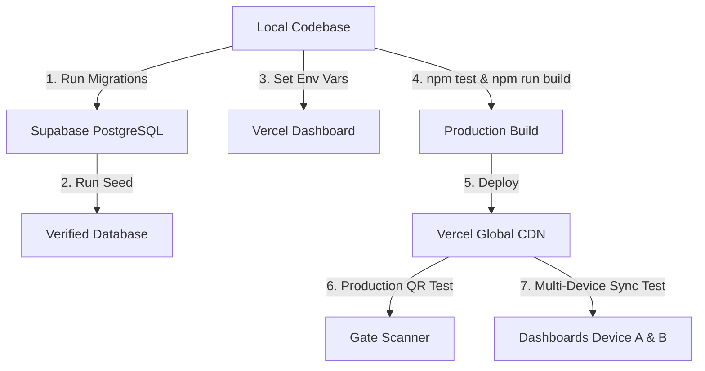

# VYUGAM 2.0 — Supabase Connectivity & Production Deployment Guide

This guide provides the complete, end-to-end instructions for deploying **VYUGAM 2.0 Attendance System** with **Supabase PostgreSQL** as the single source of truth and **Vercel** as the hosting platform.

---

## 1. Supabase Project Setup

1. Log in to [Supabase Dashboard](https://supabase.com/dashboard).
2. Click **New Project**.
3. Fill in the details:
   - **Name**: `vyugam-2026-attendance` (or your preferred name)
   - **Database Password**: Generate and securely save a strong password
   - **Region**: Choose the closest region to your venue (e.g., `ap-south-1` Mumbai)
4. Wait ~2 minutes for the database cluster to provision.

---

## 2. Environment Variables & Credentials

### Where to Find Your API Keys in Supabase
1. In your Supabase project dashboard, navigate to **Project Settings** (gear icon) > **API**.
2. Find the following values:
   - **Project URL**: Under `Project URL` (e.g. `https://xyzcompany.supabase.co`)
   - **Anon / Publishable Key**: Under `Project API keys` > `anon` / `public`
   - **Service Role Key** (Sensitive): Under `Project API keys` > `service_role`

### Required Variables
| Variable | Environment | Description |
|---|---|---|
| `VITE_SUPABASE_URL` | Client & Vercel | Your Supabase Project REST URL |
| `VITE_SUPABASE_ANON_KEY` | Client & Vercel | Supabase Public Anon API key (can also use `VITE_SUPABASE_PUBLISHABLE_KEY`) |
| `VITE_DEFAULT_EVENT_ID` | Client & Vercel | Default event identifier (`VYUGAM-2026`) |
| `SUPABASE_SERVICE_ROLE_KEY` | Server / CLI Only | Privileged administrative key (**NEVER** expose to browser) |

### ⚠️ Critical Security Rules
> [!CAUTION]
> - **NEVER** prefix `SUPABASE_SERVICE_ROLE_KEY` with `VITE_`. Any variable starting with `VITE_` is bundled directly into frontend JavaScript code and visible to anyone in DevTools!
> - **NEVER** commit `.env` or `.env.local` to Git.
> - **NEVER** place API keys or database passwords directly in source code.
> - The frontend client only requires `VITE_SUPABASE_URL` and `VITE_SUPABASE_ANON_KEY`.

---

## 3. Database Migration Sequence

Run the SQL migrations in order in the **Supabase SQL Editor** (or via Supabase CLI):

### Execution Order:
1. `supabase/migrations/20260920000000_init_schema.sql`
   - Creates `participants`, `events`, `coordinators`, `attendance` tables.
   - Creates unique partial indexes preventing duplicate check-ins.
   - Defines initial `verify_and_checkin` PostgreSQL RPC.
   - Enables Row Level Security (RLS).
2. `supabase/migrations/20260921000000_add_participant_event_selections.sql`
   - Creates `participant_event_selections` table with unique constraint `(participant_id, event_id)`.
   - Updates `verify_and_checkin` RPC to accept `p_event_ids UUID[]` for atomic event selections.
   - Creates `update_participant_event_selections` RPC.
3. `supabase/migrations/20260921010000_add_reset_scanned_attendance.sql`
   - Creates `reset_scanned_attendance` RPC for safely resetting scanned data while preserving participants and coordinators.
4. `supabase/seed.sql`
   - Seeds the 5 official events (`CODE_CRUSADE`, `LOGIC_ARENA`, `UIUX_STUDIO`, `TECH_TACTICS`, `PIXEL_PULSE`).
   - Seeds coordinator credentials (`Sakho115 (Admin)` and event coordinators).
   - Seeds official attendee directory (173 participants).

---

## 4. Verification Checklist

After running the migrations and seed script in the Supabase SQL Editor, verify your database:

### 1. Table Verification
Run this query in the SQL Editor:
```sql
SELECT table_name 
FROM information_schema.tables 
WHERE table_schema = 'public' 
ORDER BY table_name;
```
**Expected tables**:
- `attendance`
- `coordinators`
- `events`
- `participant_event_selections`
- `participants`

### 2. Row Level Security (RLS) Verification
```sql
SELECT tablename, rowsecurity 
FROM pg_tables 
WHERE schemaname = 'public';
```
**Expected**: All 5 tables must have `rowsecurity = true`.

### 3. Check-in RPC Verification
Test the atomic check-in function with test token:
```sql
-- Test pass validation for Ashok (Pass ID: VYG26-00045)
SELECT verify_and_checkin(
    p_qr_token := '4c2c6c2c8a709e24fd0d256e25a072e7c9009077e0c7343b778948bcfdb8ee5e',
    p_attendance_type := 'OVERALL',
    p_event_ids := ARRAY['e1000000-0000-0000-0000-000000000001'::uuid, 'e3000000-0000-0000-0000-000000000003'::uuid]
);
```
**Expected Result**: JSON with `"status": "SUCCESS"`, `"success": true`, returning participant and selected events.

---

## 5. Deployment Sequence

Follow this sequence for zero-downtime production deployment:



### Step-by-Step:
1. **Configure Vercel Environment Variables**:
   In Vercel Dashboard > Project > **Settings** > **Environment Variables**, add:
   - `VITE_SUPABASE_URL` = `https://your-project.supabase.co`
   - `VITE_SUPABASE_ANON_KEY` = `your-anon-key`
   - `VITE_DEFAULT_EVENT_ID` = `VYUGAM-2026`
2. **Build and Test Locally**:
   ```bash
   npm test
   npm run build
   ```
3. **Deploy to Vercel**:
   Push to GitHub (`git push -u origin main`) or run `npx vercel --prod`.

---

## 6. Multi-Device Realtime Synchronization Verification

After deployment, test on two separate physical devices (e.g. Coordinator Phone & Admin Laptop):

1. **Device A (Phone)**:
   - Log in as `Sakho115 (Admin)` or `Ashwin Kumar (Overall)`.
   - Open `/attendance/overall`.
   - Scan a valid QR code and select 2 events (e.g., Code Crusade & UI/UX Studio).
   - Click "Confirm Check-in".
2. **Device B (Laptop)**:
   - Open `/dashboard/overall`.
   - **Observe without reloading**: Within ~500ms, the `Overall Checked In` count increases by 1, the event selection counters update, and the new check-in appears in the table.
3. **Device B Refresh**:
   - Refresh the page on Device B.
   - The counts remain identical, verifying that data was loaded from Supabase PostgreSQL as the single source of truth.

---

## 7. Export Consistency Verification

1. Navigate to `/dashboard/overall` or `/reports`.
2. Select **Attendance Status**: `Entered Participants`.
3. Click **Download Sheets** (Excel), **Download CSV**, and **Download PDF**.
4. Open all three downloaded files:
   - **Verification**: Every single row in all three files must have `Overall Attendance = ENTERED` and a valid check-in time.
   - **Verification**: Zero unentered participants appear in the files.
   - **Verification**: Row count in Excel == Row count in CSV == Row count in PDF.

---

## 8. Troubleshooting

| Issue | Cause | Solution |
|---|---|---|
| Different devices show different counts | App was using local storage mock fallback | Ensure `VITE_SUPABASE_URL` and `VITE_SUPABASE_ANON_KEY` are configured in Vercel. Stale local storage has been removed. |
| Scan error: "Pass not registered" | QR token does not match any row in `participants` table | Verify token exists in `participants.qr_token` in Supabase. |
| Scan error: "Unable to record attendance" | Supabase RPC or network error | Verify `verify_and_checkin` function exists in Supabase and network is active. |
| Realtime updates not received on Device B | Realtime not enabled for table in Supabase | In Supabase Dashboard, go to **Database** > **Replication** > Enable replication for `attendance` and `participant_event_selections`. |
| 404 on page refresh on Vercel | Missing SPA rewrites | Covered by `vercel.json` rewrite rule: `/(.*) -> /index.html`. |
